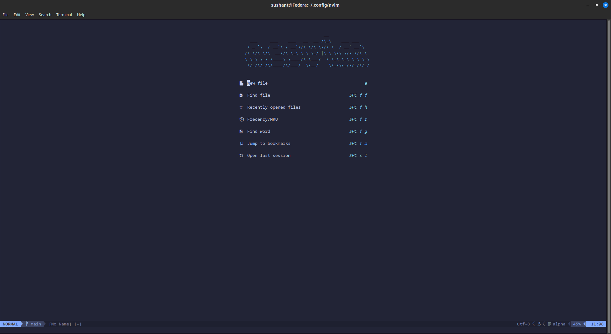
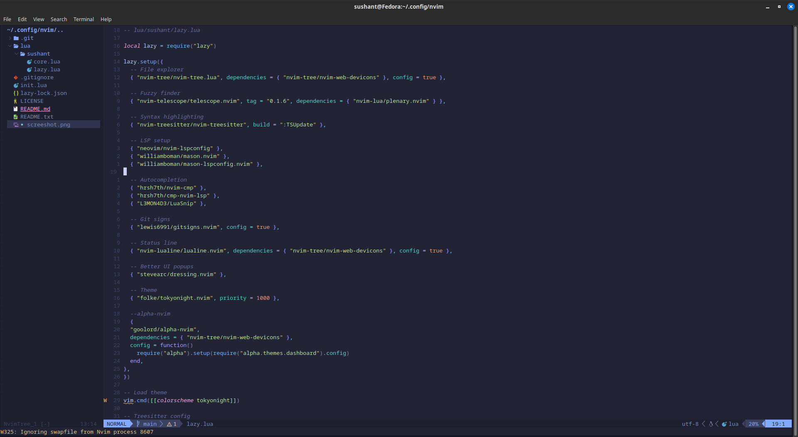

````markdown
[](https://github.com/sushaaant20/nvim-config/blob/main/screeshot.png)


# 🧠 My Neovim Setup

This is my custom, full-featured Neovim configuration built for smooth development in **Python**, **Lua**, and general-purpose coding. It uses a dark aesthetic (`tokyonight`), Treesitter syntax, LSP support, and modern plugins.

> ⚙️ Running on **Fedora Linux** with Neovim 0.9+ and Python 3.13  
> ✨ Theme: [tokyonight.nvim](https://github.com/folke/tokyonight.nvim)

---

## 📦 Features

- 🌙 **Dark Theme**: `tokyonight`
- 🧠 **LSP**: `pyright`, `lua_ls` via `mason.nvim`
- 🔍 **Fuzzy Finder**: `telescope.nvim`
- 🌲 **Syntax Highlighting**: `nvim-treesitter`
- 📂 **File Explorer**: `nvim-tree.lua`
- 🤖 **Autocompletion**: `nvim-cmp` + `LuaSnip`
- 🎨 **Icons**: `nvim-web-devicons`
- 📌 **Git Integration**: `gitsigns.nvim`
- 📊 **Status Line**: `lualine.nvim`

---

## 🛠️ Installation

### 1. Clone This Config

```bash
git clone git@github.com:sushaaant20/nvim-config.git ~/.config/nvim
````

---

### 2. Install Nerd Font (Important)

Download and install a [Nerd Font](https://www.nerdfonts.com/font-downloads) such as:

* JetBrainsMono Nerd Font
* FiraCode Nerd Font
* Hack Nerd Font

Then set your terminal font to one of them.

---

## 🚀 First-Time Neovim Setup

1. Open Neovim:

```bash
nvim
```

2. Wait for all plugins to install automatically via `lazy.nvim`

3. `mason.nvim` will install LSPs like `pyright` and `lua_ls`

4. Start coding 🎉

---

## 📦 Dependencies

Make sure the following are installed on your system:

* [Neovim](https://neovim.io/) (version 0.9 or later)
* [Git](https://git-scm.com/)
* [Python 3.13+](https://www.python.org/)
* Python `pip` and `venv` modules
* [Nerd Fonts](https://www.nerdfonts.com/)

---

## 🗂️ File Structure

```bash
~/.config/nvim
├── init.lua                # Main entry point
├── lazy-lock.json          # Plugin lockfile
├── README.md               # This file
├── lua/
│   └── sushant/
│       ├── core.lua        # (Optional config helper file)
│       └── lazy.lua        # Plugin definitions + setup
```

---

## 💡 Restore on New Machine (Manual for now)

```bash
# Step 1: Clone this config
git clone git@github.com:sushaaant20/nvim-config.git ~/.config/nvim

# Step 2: Install a Nerd Font manually (JetBrainsMono, FiraCode, etc.)

# Step 3: Launch Neovim and let it auto-setup
nvim
```

---

## 📜 License

This is my personal config, shared for learning and reuse.
Feel free to fork and customize it. Give credit if you use it publicly. 🙏

---

## 👤 Author

**Sushant Pawar**
📧 [pawarsushant531@gmail.com](mailto:pawarsushant531@gmail.com)
🐙 [GitHub: sushaaant20](https://github.com/sushaaant20)

---

````

